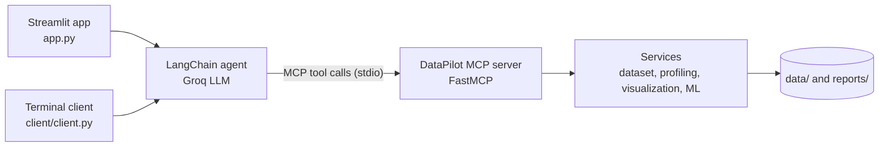

# DataPilot-MCP

 

**Talk to your data.** DataPilot is a [Model Context Protocol](https://modelcontextprotocol.io) (MCP) server that gives an LLM agent real data-analysis tools: profiling, statistics, outlier detection, charts and model training. It ships with a Streamlit chat app where you upload a CSV or Excel file and ask questions in plain English, plus a terminal client.

Built with FastMCP, LangChain, Groq (OpenAI-compatible API), Streamlit, pandas and scikit-learn.

## Features

- **10 analysis tools** exposed over MCP (plus a `hello` health check), backed by pandas and scikit-learn.
- **Upload and ask.** Drop a file in the Streamlit sidebar and ask questions about it. Tool calls are shown in expandable panels and generated charts render inline.
- **Stateful sessions.** Loaded datasets stay in memory across questions, so follow-ups like "now check for outliers" just work.
- **Self-correcting agent.** Tool errors are returned to the model as text, so it can fix a call (for example, load the dataset first) instead of failing.
- **Pluggable model.** Uses any Groq-hosted model with tool calling; defaults to `openai/gpt-oss-120b`.
- **Multiple formats.** The server reads CSV, Excel (`.xlsx`), JSON and Parquet; the web uploader accepts CSV and Excel.

## How it works



The client launches the MCP server as a subprocess, lists its tools and hands them to an LLM agent. The agent decides which tools to call, the server runs them, and the results flow back to the model, which writes the answer.

## Tools

| Tool | What it does |
|------|--------------|
| `load_dataset(file_path)` | Loads a CSV, Excel, JSON or Parquet file into memory. Returns a `dataset_id` (the file name without its extension), row and column counts, and column names. |
| `list_datasets()` | Lists the datasets currently loaded. |
| `profile_dataset(dataset_id)` | Shape, column types, numeric vs categorical columns, missing values, duplicate count and unique values per column. |
| `descriptive_statistics(dataset_id)` | Count, mean, std, min, quartiles and max for numeric columns. |
| `missing_value_analysis(dataset_id)` | Missing count and percentage per column. |
| `duplicate_analysis(dataset_id)` | Number and percentage of duplicate rows. |
| `correlation_analysis(dataset_id)` | Correlation matrix of the numeric columns. |
| `detect_outliers(dataset_id)` | IQR-method outlier count and bounds for each numeric column. |
| `create_histogram(dataset_id, column)` | Saves a histogram PNG to `reports/` and returns its path. |
| `train_random_forest(dataset_id, target)` | Trains a Random Forest classifier (one-hot encoded categoricals, 80/20 stratified split) and returns accuracy, precision, recall and F1. |
| `hello(name)` | Health check. |

## Quick start

You need Python 3.10+ and a free [Groq API key](https://console.groq.com).

```bash
git clone https://github.com/Dinidu-Lochana/DataPilot-MCP.git
cd DataPilot-MCP

python -m venv venv
# Windows (PowerShell): venv\Scripts\Activate.ps1
# macOS / Linux:        source venv/bin/activate

pip install -r requirements.txt
```

Create a `.env` file in the project root:

```env
GROQ_API_KEY=your_key_here
# Optional. Any Groq model that supports tool calling.
GROQ_MODEL=openai/gpt-oss-120b
```

Run the web app:

```bash
streamlit run app.py
```

Or chat in the terminal (`exit` to quit):

```bash
python client/client.py
```

### Try it

The repo includes `data/customers.csv` (10 customers with age, income, purchases, city and churn). Upload it in the sidebar, or in the terminal client ask about it by path. Then try:

- "Load data/customers.csv and give me a short profile."
- "Which numeric columns have outliers?"
- "Create a histogram of income."
- "Train a random forest to predict churn and report the accuracy."

## Using the MCP server on its own

The server is a standard MCP server over stdio. Run it from the project root:

```bash
python -m server.server
```

You can inspect it without an LLM using the `fastmcp` CLI, also from the project root. Use the absolute path to your venv's Python, with forward slashes:

```bash
fastmcp list --command "C:/path/to/DataPilot-MCP/venv/Scripts/python.exe -m server.server"
```

Each `fastmcp call` starts a fresh server process, so loaded datasets are not kept between calls. Use the app or a client session for multi-step analysis.

## Project structure

```
DataPilot-MCP/
├── app.py                    Streamlit chat UI (upload and ask)
├── client/
│   └── client.py             Terminal chat client
├── server/
│   ├── server.py             FastMCP server and tool definitions
│   ├── services/             Dataset, profiling, visualization and ML logic
│   └── tools/dataset.py      File loading (CSV, XLSX, JSON, Parquet)
├── data/                     Sample data and uploaded files
├── reports/                  Generated charts (created at runtime)
├── requirements.txt
└── LICENSE
```

## Design notes

- **One long-lived MCP session.** Datasets live in the server process's memory, so each client keeps a single session open. A new server per tool call would lose everything that was loaded. The Streamlit app hosts the session on a background event loop and caches it with `st.cache_resource`.
- **A small MCP-to-LangChain bridge.** `langchain-mcp-adapters` requires `mcp<2`, while FastMCP 4 requires `mcp>=2`. Instead of downgrading the server, the project wraps each MCP tool as a LangChain `StructuredTool` using FastMCP's own client (`to_langchain_tool`).
- **Upload flow.** An uploaded file is saved to `data/`, loaded through the MCP `load_dataset` tool, and the agent is told the resulting `dataset_id`, so users never have to type a file path.

## Limitations and roadmap

Current limitations:

- Datasets are held in memory: they are lost when the server restarts and are shared by every browser tab of the Streamlit app.
- Modelling is limited to a Random Forest classifier.
- It is built for local use and trusts the file paths it is given; there is no sandboxing or authentication.
- There are no automated tests yet.

Planned:

- A pytest suite using an in-memory MCP client, plus CI.
- Data-cleaning tools (impute, drop duplicates, export) and regression and clustering models.
- Path sandboxing and per-session dataset state.
- Setup instructions for other MCP clients, and a Docker image.

## License

MIT. See [LICENSE](LICENSE).
